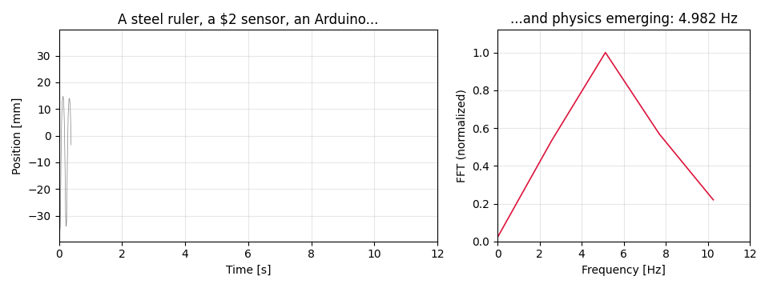
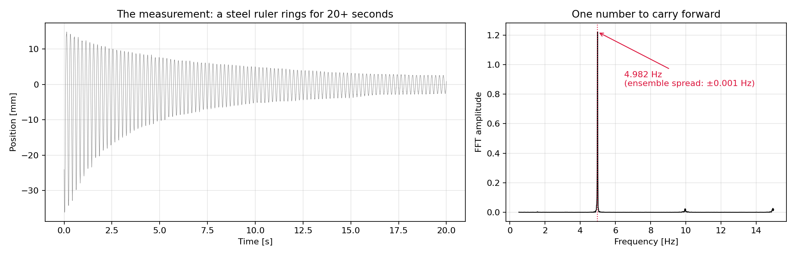
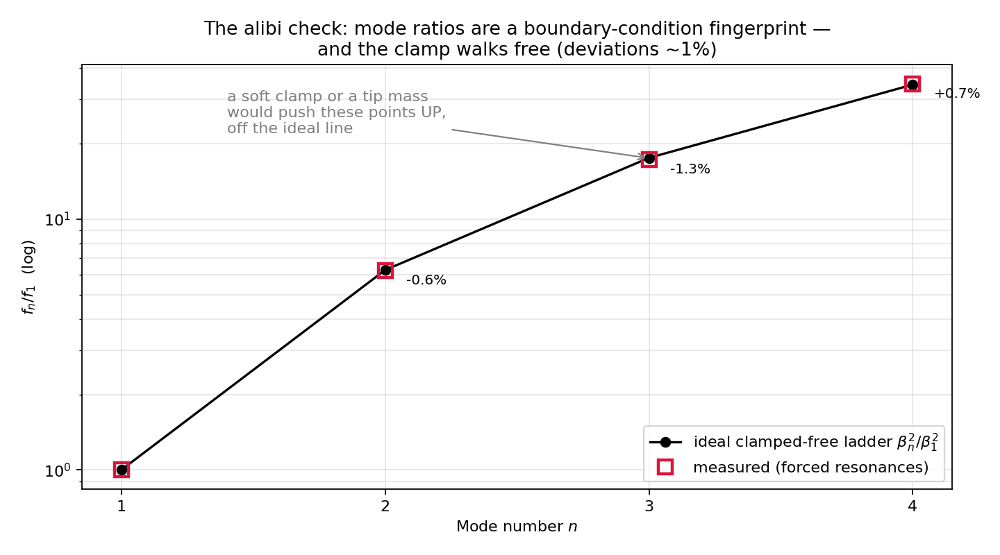
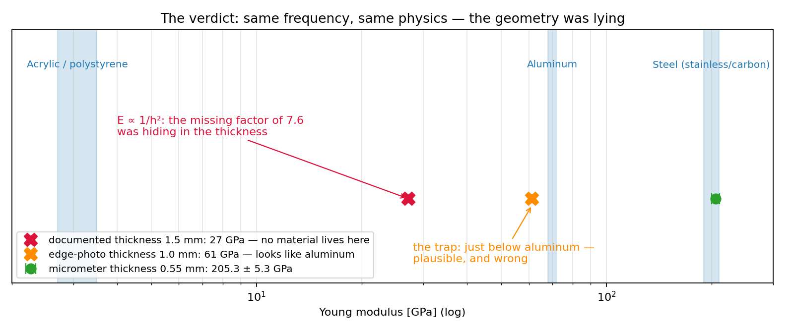
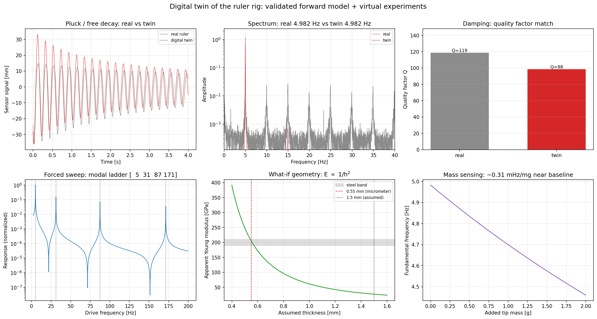

# Experimental Vibration System Identification

[](https://github.com/Rafael153Leonardo/experimental-vibration-system-identification/actions/workflows/ci.yml)
[](LICENSE)


**A steel ruler, a $2 optical sensor, an Arduino — and a Young modulus that
came out 10× too small. This is the story of finding the missing factor.**



I built the bench, adapted the sensor, acquired the data and wrote the full
Python pipeline — a home replication of a professional lab experiment, to see
how close a low-cost rig can get to laboratory precision. The pipeline turns a
raw optical signal into natural frequencies, damping, dynamic models and,
ultimately, a material's identity.

---

## Act 1 — The rig

A TCRT5000 reflective optical sensor (modified for analog readout) stares at a
clamped steel ruler; an Arduino Uno streams the raw signal at ~1 kHz over
serial (`tempo_us,leitura_bruta`). All calibration and modeling happen later
in Python. The sketch is in [`hardware/arduino/AMM.ino`](hardware/arduino/AMM.ino).

| Experimental rig | Sensor circuit | Sensor alignment |
| --- | --- | --- |
|  |  |  |

## Act 2 — The measurement

Pluck the ruler and it rings for 20+ seconds. Wavelet denoising, sub-bin FFT
interpolation and a 39-run ensemble reduce the fundamental to one very solid
number: **4.982 Hz, stable to ±0.001 Hz across runs**.



## Act 3 — The verdict that couldn't be right

Feed that frequency into the Euler–Bernoulli cantilever model with the
ruler's documented geometry and out comes **E ≈ 18 GPa** — an order of
magnitude below steel, stranded in a region of the chart where *no engineering
material lives*. The frequency was beyond suspicion. So either the model's
boundary condition was wrong (a soft clamp reads as a softer material), or the
geometry was.

## Act 4 — Interrogating the boundary

Instead of fudging the number, I designed a forced-vibration experiment:
drive the same ruler at its first four resonances. Cantilever modes are *not*
integer harmonics — they follow the `βₙ²` ladder (1 : 6.27 : 17.5 : 34.4),
and that ladder is a fingerprint of the boundary condition, independent of
the material. A soft clamp or a tip mass would push the higher ratios up, off
the ideal line.



The measured ratios sit on the ideal ladder to within ~1%. **The clamp walks
free** — which leaves the geometry as the only suspect.

## Act 5 — The missing 10×

A micrometer settled it: the blade measures **0.55 mm**, not the nominal
1 mm-class thickness that had been assumed. Since `E ∝ 1/h²`, that alone is
the missing order of magnitude. With the true thickness:



**E = 205.3 ± 5.3 GPa — squarely stainless/carbon steel.** The uncertainty
budget makes the lesson explicit: thickness contributes ±1.8%, length ±1.3%,
density ±1.3% — and the frequency only ±0.2%. *The $2 sensor was never the
limitation; the ruler's metrology was.* The reusable diagnostic lives in
[`beam_modes.py`](src/vibration_id/beam_modes.py); the full investigation is
in [`docs/ORIGINAL_CODE_AUDIT.md`](docs/ORIGINAL_CODE_AUDIT.md).

---

## Beyond the headline

The same records feed a full identification toolbox:

| Sensor nonlinearity | HAVOK reconstruction | PINN inverse problem |
| --- | --- | --- |
|  |  |  |

**Signal processing & spectral analysis** — windowed FFT with sub-bin
parabolic interpolation; Welch PSD; wavelets (CWT scalograms, DWT energy,
denoising); Hilbert-envelope damping with the physical quality factor
`Q = 2πf₀/γ` and a half-power estimator.

**Data-driven system identification** — SINDy (linear and free-Duffing, with
a dependency-free STLSQ); HAVOK (Hankel + SVD + regression); a two-stage
physics-informed neural network (PyTorch) with trainable physical parameters;
a 3-stage global Duffing fit; and a sensor output map / residual analysis
that separates mechanical dynamics from the sensor's static nonlinearity.

**Where the nonlinearity lives** — reading the instantaneous frequency and
amplitude off the ring-down settles what the model fits only hint at: the
*backbone curve is flat* (the frequency moves less than 1% across a threefold
amplitude decay, so the cubic stiffness term is a sensor-map artifact, not beam
physics), while the *envelope prefers amplitude-dependent damping* over a single
exponential (R² ≈ 0.95 → 0.998, Q ≈ 120). Linear stiffness, nonlinear
dissipation — reproducible with
[`run_backbone_damping.py`](scripts/run_backbone_damping.py).

**Digital twin** — the identified pieces compose into one end-to-end forward
model: physical parameters → Euler–Bernoulli modal frequencies → nonlinear-damped
oscillator → cubic sensor map → the signal you'd measure. Seeded with the
identified parameters it reproduces the real ruler — the synthetic ring-down, run
through the same pipeline, recovers **f₀ = 4.982 Hz to four digits**, the quality
factor, the βₙ² modal ladder and the steel verdict — then runs virtual
experiments: pluck, forced resonance sweep, geometry/material what-if, and
tip-mass sensing.



There's a no-build [interactive version](interactive/digital_twin.html): drag
`E`, `L`, `h`, tip mass, `Q` and the drive frequency and watch the signal,
spectrum, resonance sweep and material verdict update live. Reproduce the figure
with [`run_digital_twin.py`](scripts/run_digital_twin.py).

**Physics-based modeling** — Euler–Bernoulli cantilever (forward + inverse)
with a Rayleigh tip-mass correction and the modal-ladder clamp diagnostic.

**Engineering** — typed modular package · 40 regression tests · ruff lint +
format · GitHub Actions CI (3.10 / 3.12 + a job with the pysindy/torch extras).

## Results

| Context | Frequency | Geometry | Young modulus | Verdict |
| --- | ---: | --- | ---: | --- |
| Plastic ruler | `7.060 Hz` | `L=0.300 m, h=2.33 mm` | `2.99 GPa` | acrylic / PVC / polystyrene range |
| Inox ruler (raw) | `4.982 Hz` | `L=0.300 m, h=0.55 mm` | `205.3 ± 5.3 GPa` | **stainless / carbon steel** (190–210 GPa) |
| Inox ruler (synchronized) | `4.982 Hz` | `L=0.300 m, h=0.55 mm` | `205.3 GPa` | reproduces the raw inox result |
| 18 Hz baseline | `18.737 Hz` | not documented | n/a | signal-analysis validation only |

## Quick start

```bash
python -m venv .venv
source .venv/bin/activate      # Windows: .venv\Scripts\activate
pip install -e .
python scripts/run_basic_analysis.py
```

`pip install -e .` puts `vibration_id` on the path; the scripts also add `src/`
to `sys.path`, so they run from a clean checkout without installing. Generated
figures land in `figures/generated/`.

```bash
# tests
pip install -r requirements-dev.txt && pytest -q

# advanced methods (SINDy / HAVOK / PINN; the PINN demo trains on the inox sample)
pip install -r requirements-advanced.txt
python scripts/run_advanced_analysis.py --run-pinn

# reproducible Duffing + sensor identification and the global fit
python scripts/run_sensor_identification.py
python scripts/run_global_fit.py
python scripts/run_sensor_residual.py

# where the nonlinearity lives: flat backbone (linear stiffness) + nonlinear damping
python scripts/run_backbone_damping.py

# digital twin: validated forward model + virtual experiments
# (interactive version: open interactive/digital_twin.html in a browser)
python scripts/run_digital_twin.py

# material study from trial metadata
python scripts/run_material_study.py

# the story figures and the cover GIF above
python scripts/make_story_figures.py
python scripts/make_cover_gif.py
```

The CSV loader accepts the project's format variants
(`tempo_us,posicao_mm` · `tempo_s,posicao_mm_cent` · `tempo_corrigido,volt` ·
`Second,Volt`) and normalizes everything to `time_s,signal`.

## Documentation

- [`docs/EXPERIMENTAL_NARRATIVE.md`](docs/EXPERIMENTAL_NARRATIVE.md) — hardware, sensor calibration and the identification workflow
- [`docs/ORIGINAL_CODE_AUDIT.md`](docs/ORIGINAL_CODE_AUDIT.md) — audit of the original exploratory code and how it was ported / corrected here
- [`docs/FIGURE_PROVENANCE.md`](docs/FIGURE_PROVENANCE.md) — figure-by-figure origin and reproducibility
- [`docs/PROJECT_STRUCTURE.md`](docs/PROJECT_STRUCTURE.md) — module map

## License

Released under the MIT License. See [`LICENSE`](LICENSE).
