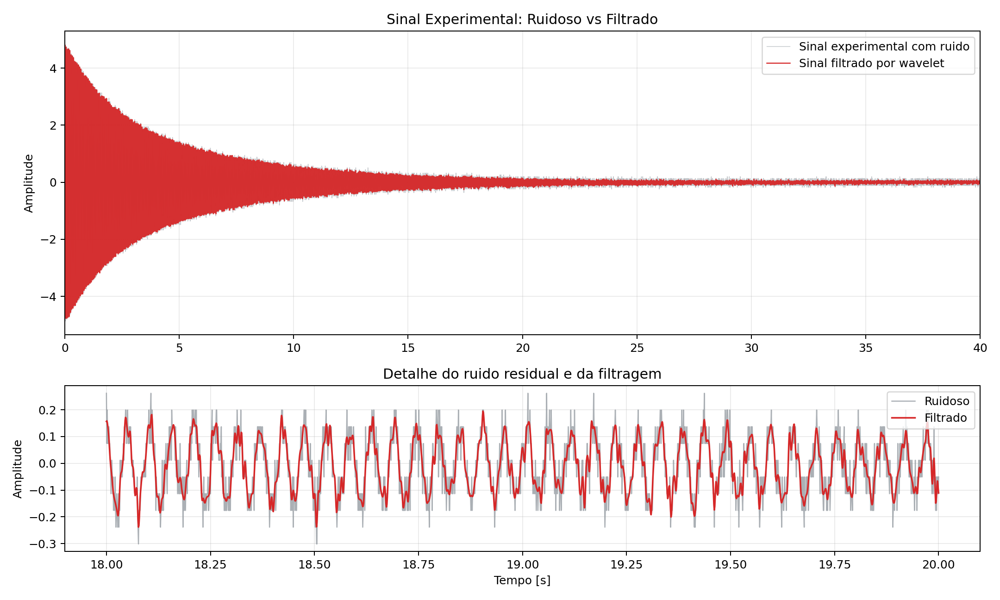
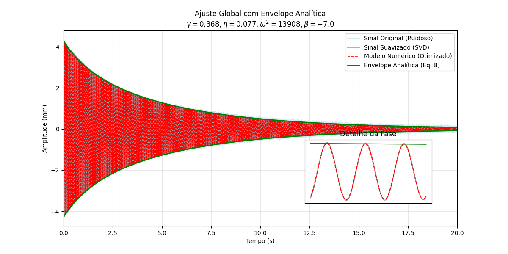
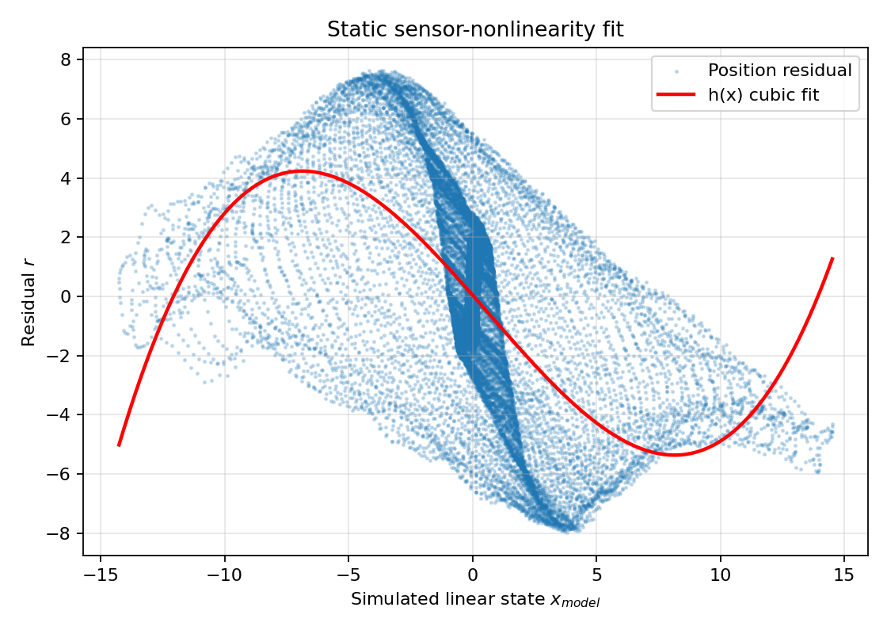
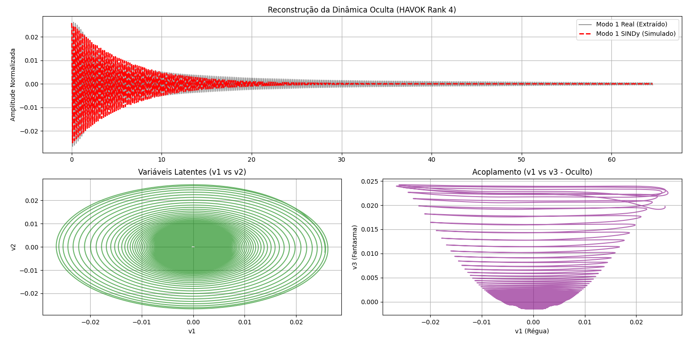
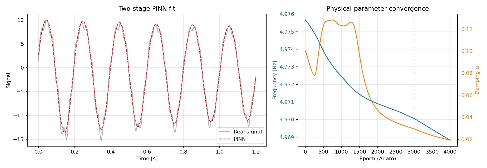

# Experimental Vibration System Identification

Pipeline em Python para analise e identificacao de sistemas vibratorias amortecidos a partir de dados experimentais.

O projeto combina:

- aquisicao e tratamento de series temporais;
- FFT e PSD para estimativa de frequencias dominantes;
- transformada de Hilbert para envoltoria e amortecimento;
- wavelets/DWT/CWT para filtragem, multirresolucao e escalogramas;
- modelo de viga Euler-Bernoulli para estimativa de material a partir da frequencia natural;
- SINDy para identificacao de modelos dinamicos;
- SVD/HAVOK e PINN como extensoes avancadas.

## Motivation

O objetivo e transformar dados experimentais de vibracao em parametros fisicos interpretaveis, como frequencia natural, amortecimento, fator de qualidade e modelos dinamicos aproximados.

Este repositorio e uma versao publica e organizada de um projeto experimental caseiro. O codigo, as figuras e as amostras reais publicadas foram separados do historico bruto de desenvolvimento.

## Hardware And Acquisition

The measurements were acquired with a modified TCRT5000 reflective optical
sensor connected to an Arduino Uno. The Arduino sampled the raw analog signal at
approximately `1000 Hz` and streamed `tempo_us,leitura_bruta` over serial; all
calibration and modeling were done later in Python.

| Experimental rig | Sensor circuit | Sensor alignment |
| --- | --- | --- |
|  |  |  |

The Arduino sketch is available at `hardware/arduino/AMM.ino`. The sensor
calibration narrative is documented in `docs/EXPERIMENTAL_NARRATIVE.md`.

## Repository Structure

```text
src/vibration_id/        Core Python package
scripts/                 Reproducible command-line analyses
hardware/arduino/        Arduino acquisition sketch
data/sample/             Small public sample datasets
data/synthetic/          Synthetic examples
figures/main/            Curated project figures
figures/setup/           Hardware and acquisition photos
figures/sensor/          Sensor-response and residual analysis
figures/generated/       Figures generated by scripts
figures/advanced/        SINDy/HAVOK/PINN figures
notebooks/               Optional exploratory notebooks
docs/                    Project notes and data policy
tests/                   Basic regression tests
```

## Quick Start

```bash
python -m venv .venv
.venv\Scripts\activate
pip install -r requirements.txt
python scripts\run_basic_analysis.py
```

The default workflow uses the real sample in
`data/sample/sample_vibration_18hz.csv`. Synthetic data is also available as a
fallback and for reproducible experiments.

Generated figures are saved to:

```text
figures/generated/
```

For tests:

```bash
pip install -r requirements-dev.txt
pytest -q
```

For advanced methods:

```bash
pip install -r requirements-advanced.txt
python scripts\run_advanced_analysis.py
python scripts\run_advanced_analysis.py --run-pinn
```

For material estimation with the Euler-Bernoulli cantilever model:

```bash
python scripts\classify_material_euler_bernoulli.py --frequency-hz 7.06
```

The same script can extract the dominant frequency from a CSV:

```bash
python scripts\classify_material_euler_bernoulli.py --csv data\sample\sample_vibration_18hz.csv
```

For the metadata-driven material study:

```bash
python scripts\run_material_study.py
```

This uses `data/sample/material_trials.csv` and avoids applying the plastic-ruler
geometry to inox samples unless the inox beam thickness is documented.

For auditing all original raw CSV files by FFT:

```bash
python scripts\audit_raw_fft.py --root C:\Users\rafael\PycharmProjects\pythonProject3_TCC --fmin 1 --fmax 80 --no-denoise
```

## Baseline Pipeline

1. Load a CSV and normalize columns to `time_s` and `signal`.
2. Remove DC offset.
3. Detect the vibration onset.
4. Apply wavelet denoising.
5. Estimate dominant frequency with FFT.
6. Fit Hilbert envelope with an exponential model.
7. Generate a CWT scalogram.
8. Estimate material class from the extracted frequency with Euler-Bernoulli.

## Example Output

The baseline script prints metrics such as:

```text
dominant_frequency_hz
gamma
Q
envelope_r_squared
```

Curated figures from the original research workflow are available in
`figures/main`, `figures/sensor` and `figures/advanced`.

The public material-study metadata is available in
`data/sample/material_trials.csv`; notes about the original material folders are
in `docs/MATERIAL_DATASETS.md`. The raw-folder FFT audit is summarized in
`docs/RAW_FFT_AUDIT.md`.

## Final Material Results

| Context | Frequency | Geometry used | Effective Young modulus | Observation |
| --- | ---: | --- | ---: | --- |
| Plastic ruler reference | `7.060 Hz` | `L=0.300 m`, `h=2.33 mm`, `b=25 mm`, `rho=1050 kg/m3` | `2.992 GPa` | Compatible with acrylic, PVC or polystyrene ranges. |
| Inox ruler, raw sample | `4.976 Hz` | `L=0.270 m`, `h=1.50 mm`, `b=20 mm`, `rho=7850 kg/m3` | `17.592 GPa` | Effective stiffness of the complete setup with a paper target at the tip. |
| Inox ruler, synchronized sample | `4.976 Hz` | `L=0.270 m`, `h=1.50 mm`, `b=20 mm`, `rho=7850 kg/m3` | `17.591 GPa` | Reproduces the raw inox result after synchronization. |
| Baseline 18 Hz sample | `18.724 Hz` | material and geometry not documented | n/a | Used for signal-analysis validation, not material classification. |

The inox setup used a paper target attached to the tip with approximate
dimensions `35 mm x 25 mm x 0.3 mm`. Because its mass was not measured, the
Euler-Bernoulli result is reported as an effective stiffness estimate of the
experimental assembly, not as a direct chemical-composition estimate.

| Noisy vs filtered signal | FFT | Global physical fit |
| --- | --- | --- |
|  |  |  |

| Sensor nonlinearity | HAVOK | PINN |
| --- | --- | --- |
|  |  |  |

## Data Formats

The loader supports the common formats used in the project:

```text
tempo_us,posicao_mm
tempo_s,posicao_mm_cent
tempo_corrigido,volt
Second,Volt
```

All are normalized internally to:

```text
time_s,signal
```

## Advanced Methods

Advanced modules are included for:

- SINDy oscillator identification;
- Hankel/SVD/HAVOK analysis;
- PINN-based parameter refinement with trainable `mu`, `alpha` and `k/m`.
- Euler-Bernoulli material classification from extracted natural frequency.

These methods may require extra dependencies listed in `requirements-advanced.txt`.

## Notes

This public repository intentionally avoids publishing the full raw development tree. It includes curated real samples, real project figures and synthetic data for comparison.

See `docs/SOURCE_MAPPING.md` for a trace from the original TCC files to the
organized public repository.

See `docs/EXPERIMENTAL_NARRATIVE.md` for the technical narrative of the
hardware setup, sensor calibration and final system-identification workflow,
written as the author's project description.
