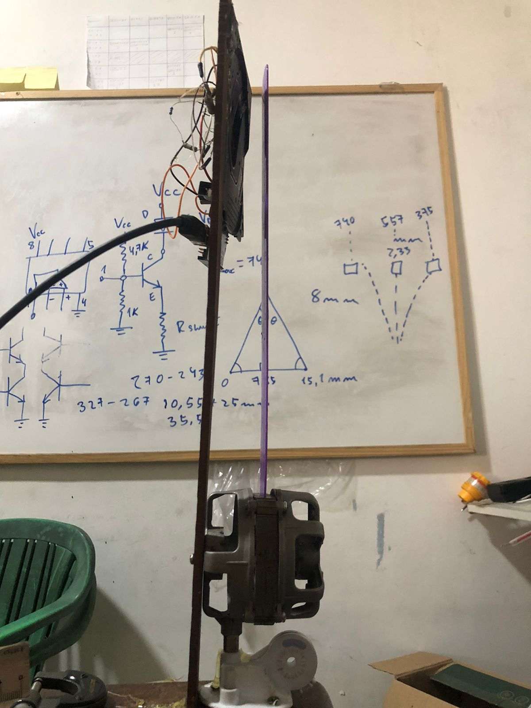
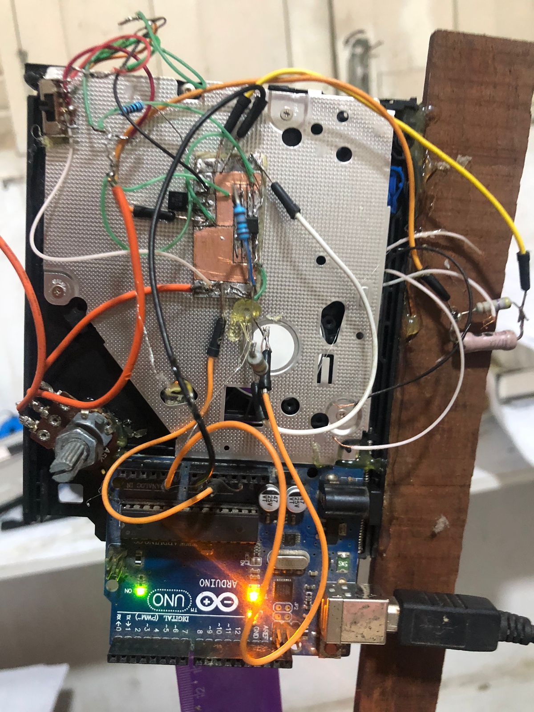
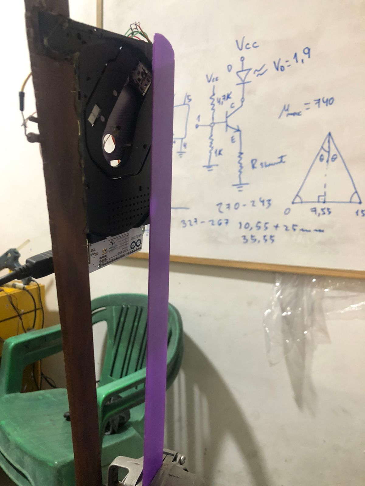
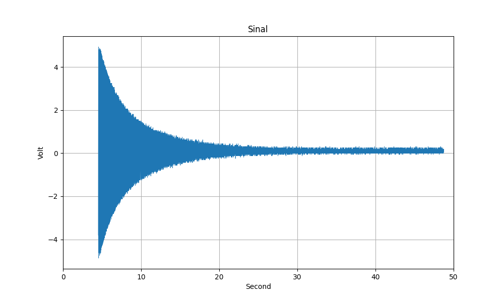
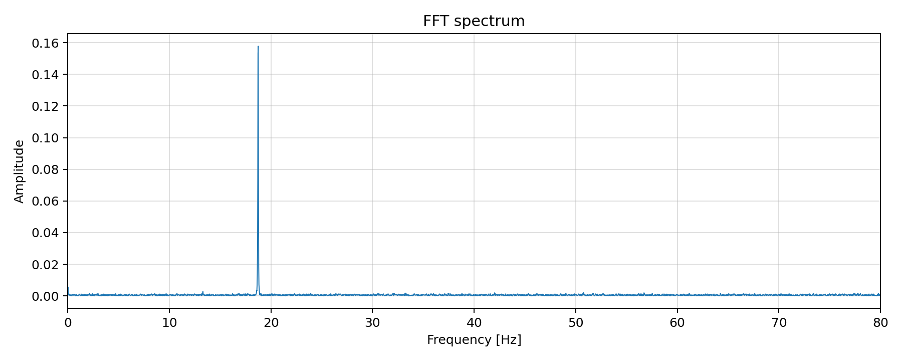
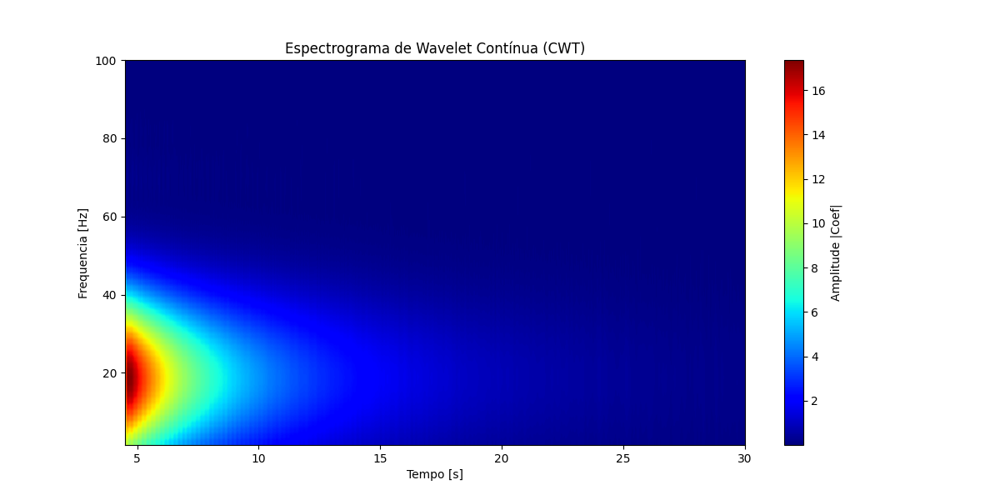
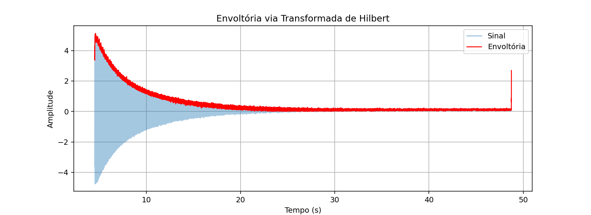
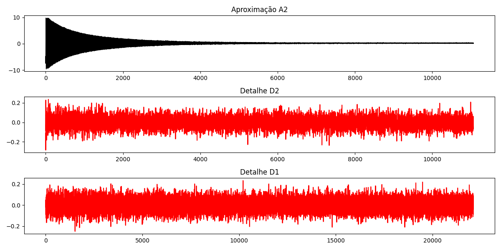
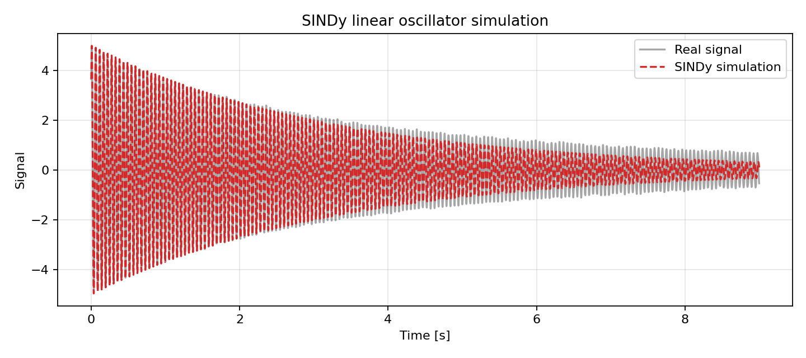

# Experimental Vibration System Identification

Pipeline em Python para analise e identificacao de sistemas vibratorias amortecidos a partir de dados experimentais.

O projeto combina:

- aquisicao e tratamento de series temporais;
- FFT e PSD para estimativa de frequencias dominantes;
- transformada de Hilbert para envoltoria e amortecimento;
- wavelets/DWT/CWT para filtragem, multirresolucao e escalogramas;
- SINDy para identificacao de modelos dinamicos;
- SVD/HAVOK e PINN como extensoes avancadas.

## Motivation

O objetivo e transformar dados experimentais de vibracao em parametros fisicos interpretaveis, como frequencia natural, amortecimento, fator de qualidade e modelos dinamicos aproximados.

Este repositorio e uma versao publica e organizada de um projeto experimental caseiro. O codigo, as figuras e as amostras reais publicadas foram separados do historico bruto de desenvolvimento.

## Hardware And Acquisition

The measurements were acquired with a modified TCRT5000 reflective optical
sensor connected to an Arduino Uno. The Arduino sampled the raw analog signal at
approximately `1000 Hz` and streamed `tempo_us,leitura_bruta` over serial; all
calibration and modeling were done later in Python.

| Experimental rig | Sensor circuit | Sensor alignment |
| --- | --- | --- |
|  |  |  |

The Arduino sketch is available at `hardware/arduino/AMM.ino`. The sensor
calibration narrative is documented in `docs/EXPERIMENTAL_NARRATIVE.md`.

## Repository Structure

```text
src/vibration_id/        Core Python package
scripts/                 Reproducible command-line analyses
hardware/arduino/        Arduino acquisition sketch
data/sample/             Small public sample datasets
data/synthetic/          Synthetic examples
figures/main/            Curated project figures
figures/setup/           Hardware and acquisition photos
figures/sensor/          Sensor-response and residual analysis
figures/generated/       Figures generated by scripts
figures/advanced/        SINDy/HAVOK/PINN figures
notebooks/               Optional exploratory notebooks
docs/                    Project notes and data policy
tests/                   Basic regression tests
```

## Quick Start

```bash
python -m venv .venv
.venv\Scripts\activate
pip install -r requirements.txt
python scripts\run_basic_analysis.py
```

The default workflow uses the real sample in
`data/sample/sample_vibration_18hz.csv`. Synthetic data is also available as a
fallback and for reproducible experiments.

Generated figures are saved to:

```text
figures/generated/
```

For tests:

```bash
pip install -r requirements-dev.txt
pytest -q
```

For advanced methods:

```bash
pip install -r requirements-advanced.txt
python scripts\run_advanced_analysis.py
python scripts\run_advanced_analysis.py --run-pinn
```

## Baseline Pipeline

1. Load a CSV and normalize columns to `time_s` and `signal`.
2. Remove DC offset.
3. Detect the vibration onset.
4. Apply wavelet denoising.
5. Estimate dominant frequency with FFT.
6. Fit Hilbert envelope with an exponential model.
7. Generate a CWT scalogram.

## Example Output

The baseline script prints metrics such as:

```text
dominant_frequency_hz
gamma
Q
envelope_r_squared
```

Curated figures from the original research workflow are available in
`figures/main` and `figures/advanced`.

| Signal | FFT | CWT |
| --- | --- | --- |
|  |  |  |

| Hilbert envelope | DWT decomposition | SINDy |
| --- | --- | --- |
|  |  |  |

## Data Formats

The loader supports the common formats used in the project:

```text
tempo_us,posicao_mm
tempo_s,posicao_mm_cent
tempo_corrigido,volt
Second,Volt
```

All are normalized internally to:

```text
time_s,signal
```

## Advanced Methods

Advanced modules are included for:

- SINDy oscillator identification;
- Hankel/SVD/HAVOK analysis;
- PINN-based parameter refinement with trainable `mu`, `alpha` and `k/m`.

These methods may require extra dependencies listed in `requirements-advanced.txt`.

## Notes

This public repository intentionally avoids publishing the full raw development tree. It includes curated real samples, real project figures and synthetic data for comparison.

See `docs/SOURCE_MAPPING.md` for a trace from the original TCC files to the
organized public repository.

See `docs/EXPERIMENTAL_NARRATIVE.md` for the narrative behind the original
`testes.py` scratch file and the `definitivo.ipynb` analysis notebook.
