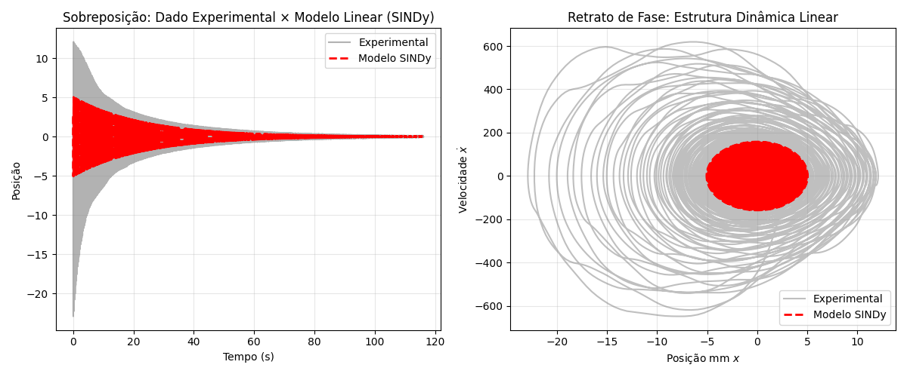
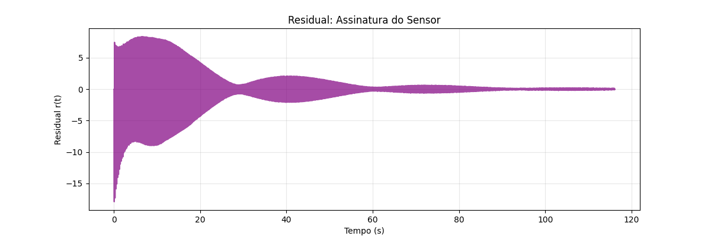
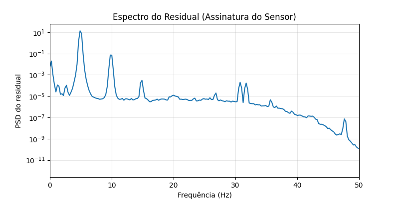
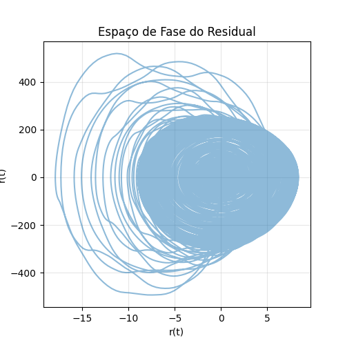
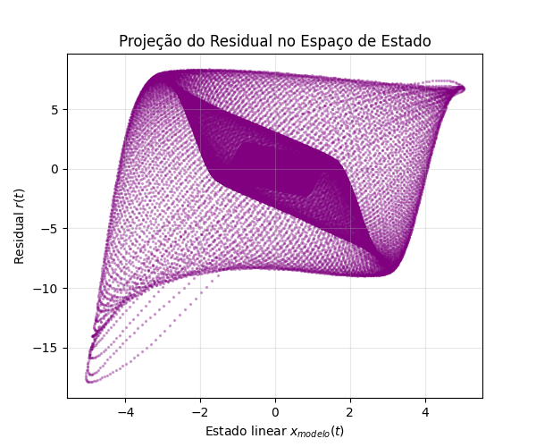
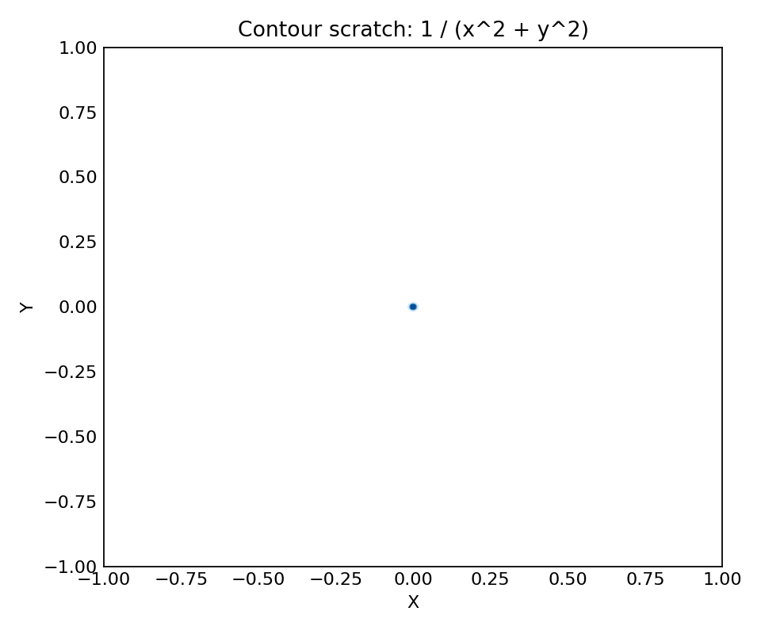

# Experimental Narrative: Acquisition, Sensor Calibration and Identification

The project starts with a custom data-acquisition arrangement built around a
modified TCRT5000 reflective optical sensor, an Arduino Uno and a mechanical
vibration target. The goal was to turn a simple reflective sensor, normally used
as a proximity/limit detector, into an analog displacement sensor capable of
recording the free vibration of a homemade oscillator.

## 1. Data-Acquisition Arrangement

The physical setup used a vertical vibrating element as the measured target and
a fixed optical sensor aligned laterally with it. The target was a narrow purple
ruler/strip attached to the mechanical structure. The reflective sensor and its
conditioning circuit were mounted on a reused support plate and connected to an
Arduino Uno, which streamed raw ADC samples to the computer.


The setup was intentionally simple: the Arduino did not perform calibration or
filtering. It only sampled the analog voltage at a fixed period and sent the raw
integer value to the computer. This decision kept the embedded system
deterministic and moved all calibration, filtering and modeling to Python.

The acquisition sketch used in the experiment is included in the repository at
`hardware/arduino/AMM.ino`:

```cpp
const int sensorPin = A0;
const unsigned long Ts_us = 1000; // 1000 Hz

unsigned long t0;
unsigned long nextSampleTime;

void setup() {
  Serial.begin(2000000);
  pinMode(sensorPin, INPUT);

  ADCSRA &= ~(bit(ADPS0) | bit(ADPS1) | bit(ADPS2));
  ADCSRA |= bit(ADPS2) | bit(ADPS0);

  t0 = micros();
  nextSampleTime = micros();

  Serial.println("tempo_us,leitura_bruta");
}

void loop() {
  unsigned long now = micros();

  if ((long)(now - nextSampleTime) >= 0) {
    int raw_value = analogRead(sensorPin);

    Serial.print(now - t0);
    Serial.print(",");
    Serial.println(raw_value);

    nextSampleTime += Ts_us;
  }
}
```

The important acquisition choices were:

- `A0` was used as the analog sensor input;
- `Ts_us = 1000` fixed the sample rate at approximately `1000 Hz`;
- `Serial.begin(2000000)` reduced serial-transfer bottlenecks;
- the ADC prescaler was changed to `32`, reducing `analogRead` latency;
- the output format was raw CSV: `tempo_us,leitura_bruta`.

## 2. Sensor Modification and Calibration

The original TCRT5000 is a reflective optical sensor with an infrared emitter
and a phototransistor detector arranged in the same direction. In the datasheet,
the device is specified as a reflective sensor with a nominal sensing distance
of `12 mm`, a phototransistor output and an infrared wavelength around `950 nm`.

In this project, the sensor was not used as a binary proximity switch. It was
modified and mounted as an analog position transducer:

- the optical pair was fixed relative to the moving target;
- the target distance and alignment were adjusted mechanically;
- the conditioning circuit was adapted for analog acquisition;
- the raw ADC response was calibrated later in Python;
- the sensor response was evaluated under the real geometry of the experiment,
  not only under the ideal mirror condition used in the datasheet.

This distinction matters. The datasheet curve is a controlled reference curve:
relative collector current versus working distance, using a standardized test
surface and specified electrical conditions. The curve recovered in this
project is an effective response curve of the complete measurement chain:

```text
TCRT5000 + custom circuit + target material + alignment + Arduino ADC
```

## 3. Recomputing the Sensor Response with SINDy

After acquiring the vibration signal, a linear SINDy model was fitted to the
dominant mechanical dynamics. This linear model captured the main oscillator:
position, velocity, linear stiffness and linear damping.

The key idea was to subtract the linear model from the measured dynamics. In
time domain and phase space, the remaining residual is not just random noise. It
contains the part of the measurement that the linear oscillator cannot explain.
That residual exposes the nonlinearity of the sensing chain.



The residual was then projected against the modeled state to estimate a static
nonlinear correction curve `h(x)`. This produced an experimentally recovered
sensor-response curve:


The same residual can be inspected as a time signal, a spectrum, a phase-space
structure and a state-space projection:









The comparison with the TCRT5000 datasheet is qualitative and structural, not a
direct one-to-one voltage overlay. The datasheet shows the idealized optical
response of the component under controlled conditions, while the recovered curve
shows how the modified sensor behaved inside the actual experiment. The
important result is that the computational method recovered a repeatable
nonlinear response shape from the residual dynamics, making the sensor itself a
modeled part of the measurement system.

| Datasheet reference | Experimental reconstruction |
| --- | --- |
| TCRT5000 reflective optical sensor with phototransistor output | Modified TCRT5000 used as analog displacement sensor |
| Standard curve: relative collector current versus working distance | Recovered curve: residual correction `h(x)` versus modeled state |
| Reference distance around `12 mm` under controlled test conditions | Real target distance/alignment defined by the homemade rig |
| Standard reflective surface in the manufacturer test circuit | Purple moving target, custom mount, custom conditioning circuit |
| Component-level optical response | Complete measurement-chain response: optics, circuit, mechanics and ADC |

## 4. From Acquisition to Physical Identification

With the measurement chain characterized, the rest of the project becomes a
complete system-identification workflow. The objective is not only to plot a
decaying oscillation, but to transform raw measurements into a physical model
with interpretable parameters: natural frequency, damping, nonlinear energy
dissipation and possible Duffing stiffness.

The original files reviewed for this narrative were:

```text
C:\Users\rafael\Documents\arduino\AMM\AMM.ino
C:\Users\rafael\Downloads\TCRT5000.PDF
C:\Users\rafael\AppData\Roaming\JetBrains\PyCharm2025.2\scratches\testes.py
C:\Users\rafael\PycharmProjects\pythonProject3_TCC\prof\definitivo.ipynb
```

The datasheet PDF was used as an engineering reference and is not redistributed
in this repository.

The exploratory script `testes.py` is a small Matplotlib scratch file. It builds
a two-dimensional grid, evaluates the scalar field `Z = 1 / (X^2 + Y^2)` and
draws contour lines. This script is not the core vibration pipeline; its value is
as a plotting prototype. It tests how contour levels behave around a strong
central singularity and can be interpreted as a visual experiment for scalar
fields, energy landscapes or cost-function surfaces.

The notebook `definitivo.ipynb` is the main technical narrative. It connects the
experimental data to a sequence of increasingly structured models: first the
signals are cleaned and synchronized, then SVD is used to remove noise, then
SINDy is used to discover candidate governing equations, and finally a
phenomenological oscillator is fitted by numerical optimization.

## Role of testes.py

`testes.py` performs four operations:

1. Imports `matplotlib` and `numpy`.
2. Creates a dense `300 x 300` grid in the interval `[-1, 1]`.
3. Computes `Z = 1 / (X^2 + Y^2)`.
4. Draws contour lines with `ax.contour`.

Technically, this is a visualization test rather than an identification script.
The function has a singularity at the origin, so the contour plot concentrates
high values near the center and produces wider bands farther away. This makes it
useful as a quick check of Matplotlib contour behavior, but it should not be
presented as evidence for the vibration model.

The best way to describe it in the project is:

```text
Exploratory contour-plot scratch used to test scalar-field visualization before
building richer figures for the vibration analysis.
```

The figure generated from this scratch is included as:



## Role of definitivo.ipynb

`definitivo.ipynb` is the final experimental notebook. It has 22 cells and
organizes the work into these phases.

### 1. Raw Data Preparation

The notebook starts by loading synchronized oscilloscope-style CSV files and
detecting the start of the oscillation by the largest derivative jump. In the
captured execution, 9 files were processed and the oscillation was shifted to
start at `t = 0`.

Next, each signal is corrected:

- time is zeroed;
- signal offset is removed;
- corrected files are saved into a dedicated folder.

The notebook reports 9 corrected files, including `sinc_sinc_scope_04.csv`
through `sinc_sinc_scope_10.csv` and two validation files.

### 2. Visual Inspection

The corrected signals are plotted in grouped figures. This stage is important
because it checks whether the preprocessing produced comparable trajectories
before any model is trained or fitted.

### 3. SVD Denoising

The notebook then applies a Hankel/SVD-style reconstruction. The core function
builds a windowed trajectory matrix, decomposes it with SVD and reconstructs the
signal using selected components.

The execution used:

```text
window L = 100
components kept = [0, 1]
```

The estimated removed noise was approximately:

```text
0.0401 to 0.0467
```

This creates the column `x_svd_limpo`, which becomes the cleaner input for the
identification steps.

### 4. SINDy and Duffing Discovery

After SVD cleaning, the notebook prepares multiple trajectories for PySINDy. It
constructs state vectors from position and velocity and fits sparse polynomial
models.

The first relevant discovery is a Duffing-style candidate:

```text
(x)' = 1.000 v
(v)' = -20.285 -13892.495 x -0.508 v + 1.132 x^2 -0.214 x v + 4.082 x^3
```

Two SINDy configurations are then compared:

```text
Model A R2 = 0.99973
Model B R2 = 0.99974
```

The notebook concludes that the cubic stiffness term is small compared with the
linear stiffness term. The practical interpretation is that the experiment is
predominantly a linear-stiffness oscillator, while nonlinear effects appear more
clearly in the damping/energy decay than in the spring term.

### 5. Smoothed Derivatives

Because velocity estimates are sensitive to noise, the notebook uses
Savitzky-Golay smoothing before differentiating. This improves the phase-space
representation and helps isolate damping terms:

```text
v term:     -0.05324
x v term:    0.12095
x^2 v term: -0.23613
```

This is a key transition in the analysis: the model stops being only a
frequency estimate and starts describing how the oscillation loses energy.

### 6. Envelope-Based Parameter Fit

The Hilbert envelope is used to fit a nonlinear damping law. The notebook
reports:

```text
gamma = 0.35865
eta   = 0.07722
R0    = 4.6580
```

Here, `gamma` represents linear damping and `eta` represents nonlinear damping.
This gives a physically interpretable description of the decay curve, not just a
black-box regression.

### 7. ODE Model and Phase Calibration

The notebook then moves from discovered equations to direct simulation. The
oscillator is written as a first-order ODE system and integrated numerically.

The model used in the final methodology is:

```text
x' = v
v' = -omega_n^2 x - beta x^3 - (gamma + eta x^2) v
```

A fine calibration step estimates:

```text
phase phi      = -0.0484 rad
omega          = 117.6848 rad/s
omega^2        = 13849.72
```

This step aligns the simulated trajectory with the experimental phase, which is
essential because a small frequency mismatch creates a large visual error over
many cycles.

### 8. Global Optimization

The final model-updating step minimizes the mean squared error between the
experimental displacement and the ODE simulation. The notebook uses
Nelder-Mead-style optimization and physical penalties to keep parameters
consistent.

The final reported parameters are:

```text
x0     = 4.2833 mm
v0     = -6.8996 mm/s
gamma  = 0.3629
eta    = 0.0809
omega^2 = 13907.74
beta   = -6.91
```

The organized figure below shows the final global fit, combining the noisy
signal, SVD-smoothed signal, optimized numerical model and analytical envelope:


The interpretation is consistent with the SINDy investigation:

- the linear stiffness dominates the response;
- nonlinear damping is relevant to the envelope decay;
- the Duffing cubic stiffness term is small in the final global fit;
- using real initial velocity improves the time-domain match.

## Project Story

The two files show the project moving from plotting experiments to model-based
identification.

`testes.py` is a visualization scratch: it verifies how contour plots represent
a scalar field with strong gradients. It is useful as a plotting experiment, but
not as the main engineering result.

`definitivo.ipynb` is the central experimental notebook. It builds a complete
pipeline:

```text
raw CSVs
  -> event detection
  -> time and offset correction
  -> visual inspection
  -> SVD denoising
  -> SINDy equation discovery
  -> Duffing/nonlinearity investigation
  -> Hilbert envelope fitting
  -> ODE simulation
  -> global parameter optimization
```

The strongest technical conclusion is that the measured system behaves mainly
as a linear oscillator in stiffness, with damping behavior that benefits from a
nonlinear term. In portfolio language, the notebook demonstrates signal
processing, numerical linear algebra, sparse system identification and
physics-informed model calibration applied to a real home-built experiment.

## Suggested Public Description

```text
I built a vibration-analysis pipeline from a home experiment, starting with raw
CSV signals and ending with an interpretable oscillator model. The workflow
includes event detection, offset correction, SVD denoising, SINDy equation
discovery, Hilbert-envelope damping estimation and ODE-based global parameter
optimization. The final analysis indicates a predominantly linear stiffness
response with relevant nonlinear damping in the energy decay.
```
